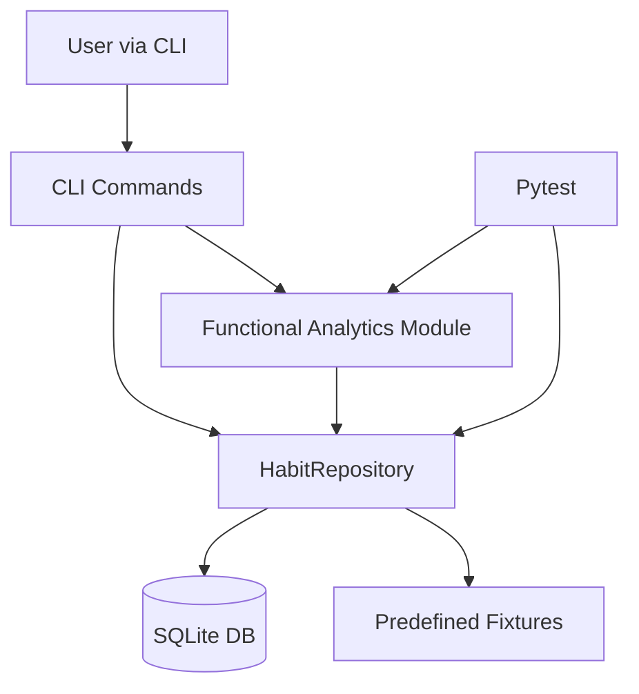

# Conception Phase — Habit Tracker Concept

## Goal
Build a Python backend for a habit tracking app that supports creating habits, checking off tasks, persistence between sessions, and functional analytics.

## Architecture
Components:
1. Domain model (`Habit`, `Periodicity`)
2. Persistence layer (`HabitRepository`, SQLite)
3. Analytics module (functional functions)
4. CLI interface (`argparse`)
5. Fixtures and tests

## Data model
- Habit fields: `id`, `name`, `description`, `periodicity`, `created_at`.
- Completion fields: `id`, `habit_id`, `completed_at`.
- One habit can have many completions.

## User flow
1. Initialize database.
2. Load predefined habits (or create custom ones).
3. Check off tasks with timestamps.
4. Analyse streaks and filter habits by periodicity.

## Justification
- SQLite is built-in and persistent.
- A repository class cleanly separates DB operations.
- Analytics functions are implemented functionally (pure computation from inputs).
- CLI makes API usage explicit and testable.
